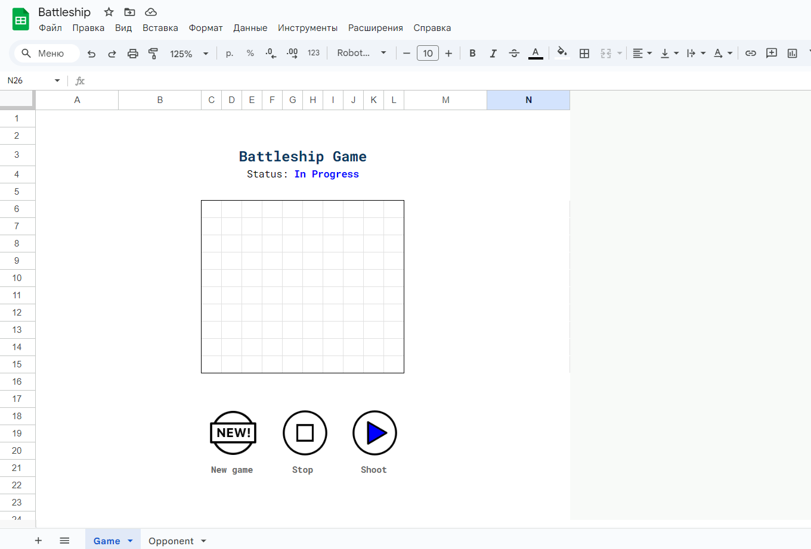
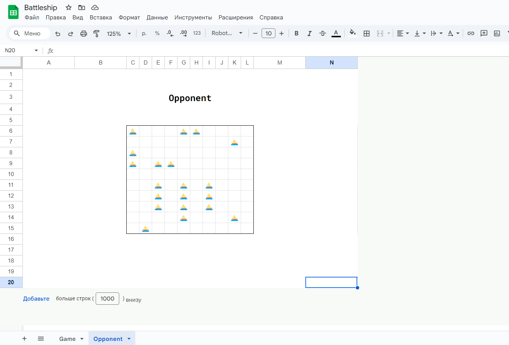
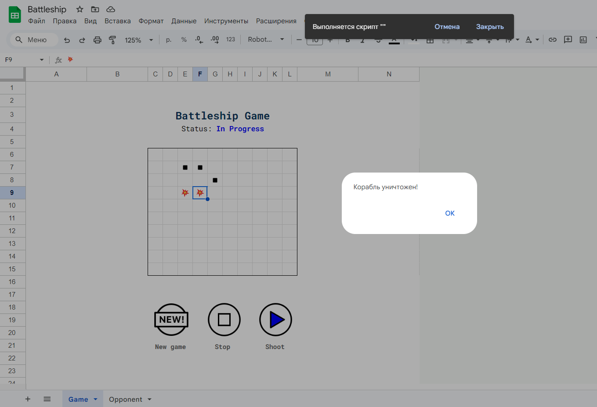
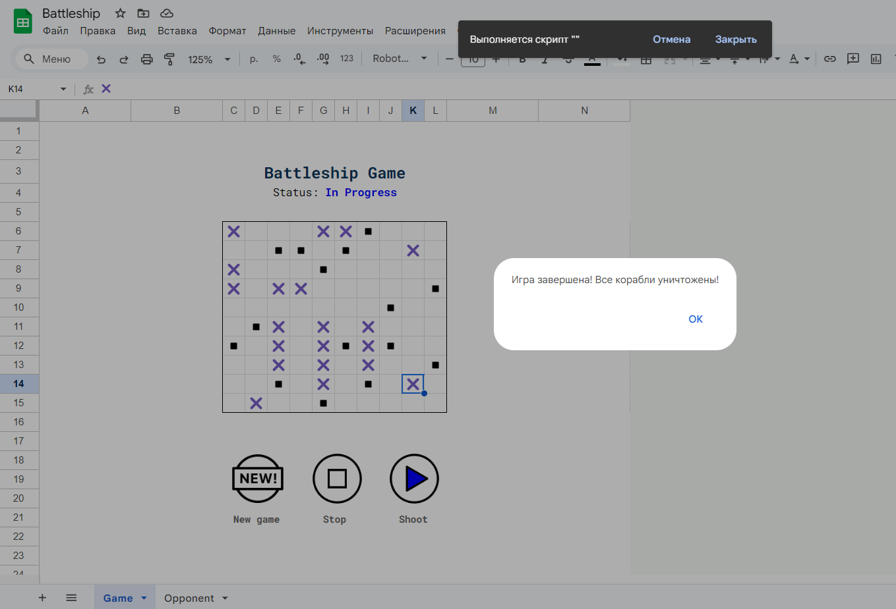

# Battleship / "Морской бой"

Это реализация игры "Морской бой" в Google таблицах в однопользовательском режиме.

Правила классической игры
---
Полная статья размещена [здесь](https://ru.wikipedia.org/wiki/Морской_бой_(игра)).

«Морской бой» – игра для двух участников, в которой игроки по очереди называют координаты на карте соперника. Если у врага с этими координатами имеется «корабль», то корабль или его палуба убивается, попавший делает еще один ход. Цель: первым убить все «корабли» противника.

Игровое поле – квадрат 10×10 у каждого игрока, на котором размещается флот кораблей. Горизонтали нумеруются сверху вниз, а вертикали помечаются буквами слева направо.

Размещаются:
* 1 корабль – ряд из 4 клеток («четырёхпалубный»; линкор)
* 2 корабля – ряд из 3 клеток («трёхпалубные»; крейсера)
* 3 корабля – ряд из 2 клеток («двухпалубные»; эсминцы)
* 4 корабля – 1 клетка («однопалубные»; торпедные катера)

При размещении корабли не могут касаться друг друга сторонами и углами.

Особенности данной игры
---

Данная игра реализована в однопользовательском режиме в Google Sheets.

Используются два листа: Game (на котором происходит игра) и Opponent (на котором расположено поле с вражескими кораблями). Чтобы начать новую игру, игрок нажимает кнопку "New Game", чтобы прекратить игру – кнопку "Stop", чтобы сделать ход – кнопку "Shoot". После нажатия кнопки "New game" корабли на листе "Opponent" будут расставлены, и статус сменится на "In Progress".

Вид листа "Opponent". Этот лист можно скрыть, чтобы не искушаться возможностью подсмотреть расположение кораблей.

В случае, если игрок не попадает в корабль, в ячейке появляется знак ◾️, если попадает – знак 💥, а если корабль полностью уничтожен, он закрашивается знаками ✖️, и появляется сообщение "Корабль уничтожен!".

В конце игры появится сообщение "Игра завершена! Все корабли уничтожены!".

Как развернуть у себя
---

Скачайте файл [Battleship.xlsx](Battleship.xlsx) и импортируйте его в Google Sheets ("Файл" -> "Импортировать").

После загрузки перейдите в "Расширения" -> "Apps Script". Замените **function myFunction() {}** кодом [отсюда](code.gs). Сохраните.

Далее на листе "Game" назначьте каждой кнопке свой скрипт (нажать на кнопку -> "..." -> "Назначить скрипт"):

* кнопка "New game" – newGame
* кнопка "Stop" – stopGame
* кнопка "Shoot" – shoot

Приятной игры!
